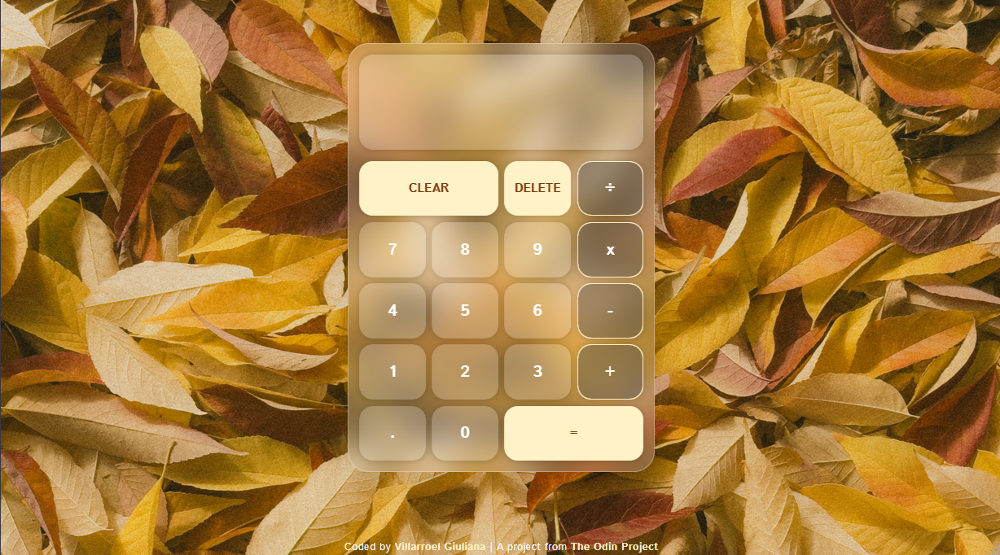

# Glass Calculator ✨

A modern, fully functional calculator with a beautiful glassmorphism design, built with vanilla JavaScript as part of [The Odin Project](https://www.theodinproject.com/) curriculum.



## Features

-   **Basic Arithmetic Operations**: Addition, subtraction, multiplication, and division
-   **Decimal Support**: Full support for decimal numbers with validation
-   **Input Validation**:
    -   Prevents multiple decimal points in a single number
    -   Prevents multiple leading zeros
    -   Handles division by zero with error message
-   **Chained Operations**: Calculate multiple operations in sequence
-   **Clear & Delete**: Clear all or delete last digit
-   **Real-time Display**: Shows current operation and input simultaneously
-   **Responsive Design**: Works seamlessly on desktop, tablet, and mobile devices
-   **Glassmorphism UI**: Modern, elegant design with backdrop blur effects

## Technologies Used

-   **HTML5**: Semantic markup with BEM methodology for class naming
-   **CSS3**:
    -   Custom properties (CSS variables)
    -   Glassmorphism effects with `backdrop-filter`
    -   CSS Grid for button layout
    -   Responsive design with `clamp()` functions
    -   CSS transitions for smooth interactions
-   **JavaScript (ES6+)**:
    -   DOM manipulation
    -   Event handling
    -   State management
    -   Input validation
    -   Modular function design

## Project Structure

```
glass-calculator/
├── index.html
├── assets/
│   ├── css/
│   │   └── style.css
│   ├── images/
│   │   └── background.jpeg
│   └── js/
│       └── script.js
└── README.md
```

## What I Learned

Through this project, I gained hands-on experience with:

-   **BEM Methodology**: Implementing Block Element Modifier naming convention for maintainable CSS
-   **State Management**: Managing application state in vanilla JavaScript without frameworks
-   **Event Delegation**: Efficiently handling multiple button clicks
-   **Input Validation**: Implementing edge case handling for user input
-   **CSS Advanced Techniques**: Creating glassmorphism effects and responsive layouts
-   **DOM Manipulation**: Dynamically updating the UI based on user interactions
-   **Code Organization**: Structuring JavaScript with modular, reusable functions

## Key Implementation Details

### Number Input Handling

-   Concatenates digits as strings to build numbers
-   Validates decimal point usage
-   Prevents multiple leading zeros

### Operation Flow

1. User enters first number
2. User selects an operator
3. User enters second number
4. Calculator displays result
5. Result can be used for next operation

### Division by Zero

Instead of crashing, the calculator displays: `ERROR: division by zero`

## Design Choices

-   **Glassmorphism**: Creates depth and modern aesthetic with semi-transparent backgrounds and backdrop blur
-   **Color Scheme**: Warm autumn palette with primary color `#fff2c6` and secondary `#7a390c`
-   **Typography**: Istok Web font for clean, readable interface
-   **Layout**: CSS Grid for perfectly aligned calculator buttons

## Future Enhancements

Potential features to add:

-   [ ] Keyboard support
-   [ ] Operation history
-   [ ] Memory functions (M+, M-, MR, MC)
-   [ ] Percentage calculations
-   [ ] Scientific calculator mode
-   [ ] Theme switcher (light/dark mode)
-   [ ] Sound effects on button press

## Acknowledgments

-   **Project Proposed by**: [The Odin Project](https://www.theodinproject.com/)
-   **Designed & Programmed by**: Villarroel Giuliana

## License

This project is open source and available for educational purposes.
